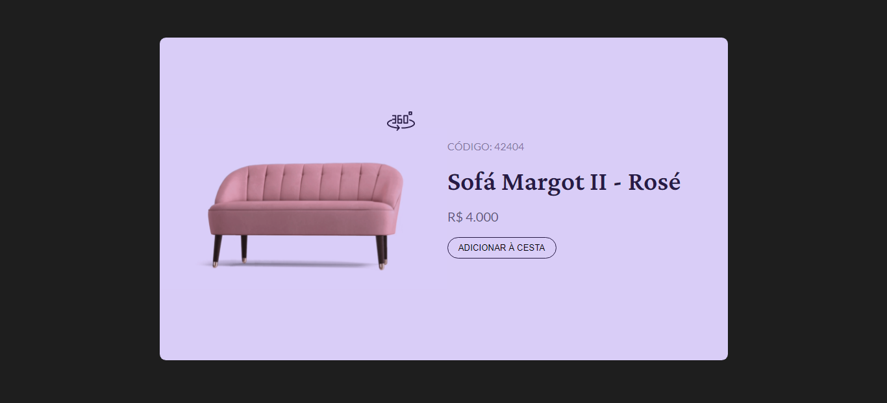

<h1 align="center"> Product card</h1>

Design de um card de produto.
 
Versão 1.0

  <a href="#-tecnologias">Tecnologias</a>&nbsp;&nbsp;&nbsp;|&nbsp;&nbsp;&nbsp;
  <a href="#-projeto">Projeto</a>&nbsp;&nbsp;&nbsp;&nbsp;&nbsp;&nbsp;

 

  

## 🚀 Tecnologias

Esse projeto foi desenvolvido com as seguintes tecnologias:

- HTML e CSS
- Git e Github
- JavaScript

## 💻 Projeto

O card tem a opção de visualizar o produto em 306°.

## 🖱️ Visite

https://jonathafernandes.github.io/product-card/

---
👨‍💻 Desenvolvedor
 
- Jonatha Fernandes
